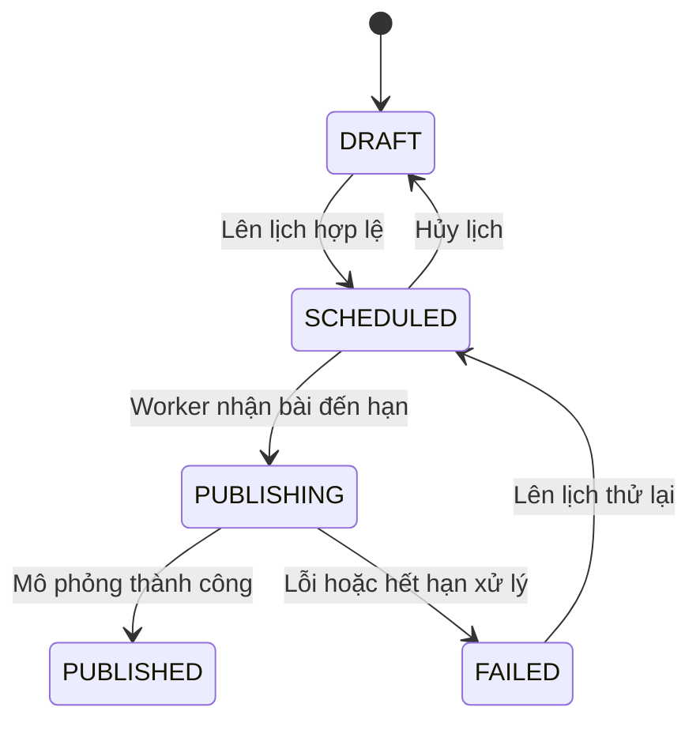

# SocialFlow — Yêu cầu MVP v1

Ngày chốt: 21/09/2026. Tài liệu dùng để triển khai và nghiệm thu, không phải báo cáo các tính năng đã hoàn thành.

Xem [Tổng quan dự án](./PROJECT_OVERVIEW.md) để biết mục tiêu, kiến trúc và stack; xem [README](../README.md) để chạy ứng dụng.

## 1. Phạm vi

Một user sở hữu một workspace, hai kênh mô phỏng Facebook/Instagram. Mỗi bài đăng thuộc một kênh, gồm văn bản và tối đa 4 ảnh. Có login, CRUD nháp, upload, preview, scheduling, lịch nội dung, dashboard và kết quả xuất bản mô phỏng.

Không tích hợp social API thật, video, đa thành viên/phân quyền nhóm, duyệt bài, AI, billing, đa ngôn ngữ, dark mode hoặc autosave trong MVP. Các giới hạn nội dung bên dưới là quy tắc của demo, không phải giới hạn chính thức của nền tảng social.

## 2. Yêu cầu theo màn hình

### AUTH-01 — Đăng nhập: `/login`

- Đăng ký email/mật khẩu (8–128 ký tự, ít nhất một chữ hoa và một ký tự đặc biệt), đăng nhập bằng email/mật khẩu hoặc Google qua backend; hiển thị loading và lỗi/hủy OAuth. Không tự gộp tài khoản trùng email.
- Lần đăng nhập đầu tạo user, workspace và hai kênh mẫu; thao tác phải an toàn khi callback được xử lý lại.
- Đăng nhập xong chuyển về dashboard; có logout.
- API bảo vệ dữ liệu bằng session và quyền sở hữu workspace, không chỉ ẩn UI.
- Thiếu/hết phiên trả `401`; UI hướng dẫn đăng nhập lại và không báo lưu thành công giả.
- Không lưu token phiên nhạy cảm trong localStorage. Nếu dùng cookie phiên, cần HttpOnly, Secure ở production và bảo vệ CSRF phù hợp.
- Email/Google login xác định user SocialFlow; không đồng nghĩa đã kết nối tài khoản Facebook/Instagram thật.

**Nghiệm thu:** người chưa đăng nhập không truy cập dữ liệu riêng; callback lặp không tạo nhiều workspace; logout làm mất quyền truy cập phiên tương ứng.

### DASH-01 — Dashboard: `/dashboard`

- Đếm các trạng thái Draft, Scheduled, Published, Failed từ database của workspace hiện tại.
- Hiển thị tối đa 5 bài sắp đăng, sắp theo `scheduledAt` tăng dần.
- Có liên kết đến danh sách bài và hành động tạo bài.
- Có skeleton, empty state, lỗi và retry.
- Dữ liệu được refresh/invalidate sau mutation liên quan.

**Nghiệm thu:** số liệu khớp với danh sách cùng workspace; không trộn dữ liệu user khác hoặc dùng số liệu engagement giả.

### POST-01 — Danh sách bài: `/posts`

- Các cột: ảnh đại diện, tiêu đề, kênh, trạng thái, lịch đăng, thời điểm cập nhật.
- Tìm trong tiêu đề/nội dung; debounce khoảng 300 ms.
- Filter theo trạng thái và kênh; sort theo cập nhật hoặc lịch đăng.
- Phân trang server, mặc định 20 bài/trang, có tổng số kết quả.
- Search/filter/sort/page nằm trong URL; đổi filter đưa về trang 1.
- Reload, Back/Forward và mở link trực tiếp khôi phục đúng điều kiện.
- Có loading, chưa có dữ liệu, không có kết quả và lỗi/retry riêng.
- Xóa nháp có xác nhận; nếu trang cuối hết bản ghi phải điều chỉnh về trang hợp lệ.

Ví dụ: `/posts?q=khuyen-mai&status=scheduled&channel=instagram&page=2`.

**Nghiệm thu:** seed khoảng 200 bài để thử pagination; response của truy vấn cũ không ghi đè kết quả mới khi gõ nhanh; sort có tiêu chí phụ ổn định khi dữ liệu cùng giá trị.

### POST-02 — Soạn bài: `/posts/new` và `/posts/[id]`

| Trường         | Quy tắc                                                           |
| -------------- | ----------------------------------------------------------------- |
| Tiêu đề nội bộ | Bắt buộc, tối đa 100 ký tự                                        |
| Nội dung       | Nháp được để trống; khi lên lịch phải có 1–2.000 ký tự            |
| Kênh           | Một kênh thuộc workspace hiện tại                                 |
| Ảnh            | JPEG/PNG/WebP; tối đa 4 ảnh, mỗi ảnh không quá 5 MB               |
| Instagram mẫu  | Cần ít nhất 1 ảnh khi lên lịch                                    |
| Thời gian      | Sau thời gian server ít nhất 5 phút khi tạo/đổi lịch hoặc thử lại |

- Preview cập nhật theo nội dung và kênh đã chọn; không cam kết giống tuyệt đối UI social thật.
- Từng ảnh có trạng thái uploading/success/error, xóa và retry; giữ thứ tự ảnh.
- Không cho lên lịch nếu ảnh chưa upload hoàn tất hoặc chưa được server xác nhận.
- Lưu nháp thủ công, hiển thị pending và thời điểm lưu thành công.
- Không mất nội dung khi API/upload lỗi; lỗi field gắn với trường tương ứng.
- Cảnh báo khi rời trang có thay đổi chưa lưu trong các luồng điều hướng ứng dụng hỗ trợ.
- Khi đọc bài không tồn tại hoặc không thuộc workspace, xử lý `404`.

**Nghiệm thu:** tạo/sửa rồi reload vẫn đúng dữ liệu; click lưu nhiều lần không tạo nhiều bài; hai tab sửa cùng bài được phát hiện bằng version thay vì ghi đè âm thầm.

### MEDIA-01 — Upload

1. FE kiểm tra định dạng/dung lượng để phản hồi sớm.
2. Backend kiểm tra session, scope workspace và giới hạn upload, sau đó cấp signed URL.
3. Browser upload trực tiếp vào object storage.
4. Backend kiểm tra object và metadata, xác nhận file hợp lệ rồi cập nhật MediaAsset.
5. Chỉ media đã xác nhận, thuộc workspace hiện tại mới được gắn vào bài.

- Không tin hoàn toàn MIME/size/asset ID do client gửi; kiểm tra phía server.
- Không để lộ storage secret cho FE; giới hạn thời hạn signed URL.
- Có tác vụ dọn ảnh chưa gắn với bài sau thời gian lưu tạm, mặc định 24 giờ; không xóa ảnh còn được tham chiếu.
- Storage provider và quota tổng mỗi workspace sẽ được cấu hình khi triển khai module media.

**Nghiệm thu:** file sai loại/quá dung lượng bị từ chối; upload lỗi cho retry; không gắn được ảnh của user khác bằng cách đổi ID.

### SCHEDULE-01 — Lên lịch và trạng thái

| Trạng thái | Thao tác cho phép                                   |
| ---------- | --------------------------------------------------- |
| DRAFT      | Sửa, xóa, lên lịch                                  |
| SCHEDULED  | Đổi lịch, hủy lịch; phải hủy trước khi sửa nội dung |
| PUBLISHING | Chỉ xem                                             |
| PUBLISHED  | Chỉ xem bài và lịch sử                              |
| FAILED     | Xem lỗi, sửa nội dung, lên lịch thử lại             |

- Validate chuyển trạng thái tại backend; chặn thao tác không hợp lệ bằng `409`.
- Lưu timestamp UTC; hiển thị theo `Asia/Ho_Chi_Minh`, có nhãn múi giờ.
- Hủy lịch đưa về DRAFT và xóa thời gian lịch hiện hành, giữ lịch sử attempt.
- Dùng `version` để chống stale update và nhận bài bằng transaction/cập nhật có điều kiện.
- Đổi/hủy lịch đồng thời với worker: chỉ một thao tác thắng, thao tác còn lại nhận conflict.
- Retry request hoặc nhấn nút lặp không được tạo nhiều job cho cùng một phiên bản lịch. UI disable chỉ hỗ trợ UX; backend vẫn phải chống trùng.

### PUBLISH-01 — Worker và kết quả

- Worker chạy như tiến trình độc lập trong `apps/api`; đóng browser không làm dừng job.
- Kiểm tra bài đến hạn khoảng 15 giây/lần; không cam kết đăng chính xác từng giây.
- Nhận bài bằng điều kiện trạng thái/version và chuyển `PUBLISHING` trước khi xử lý.
- Gọi MockPublisher rồi ghi kết quả, thời gian hoàn tất và PublishAttempt.
- Thất bại lưu error code/message có ích cho người dùng, không lộ secret hoặc stack trace.
- Có thời hạn xử lý/lease. Attempt hết hạn chuyển FAILED để retry; worker cũ không được ghi đè kết quả attempt mới sau khi mất lease.
- Seed một kịch bản lỗi cố định: lần đầu thất bại, lần retry thành công. Không dựa vào random để kiểm thử.
- UI hiển thị “Kênh mô phỏng” và “Đăng mô phỏng thành công”.
- FE polling khoảng 5 giây khi có bài đang xử lý hoặc bài lên lịch cần cập nhật; dừng khi không có việc cần theo dõi, đồng bộ lại khi quay về tab.

**Nghiệm thu:** đóng browser, chờ đến hạn rồi mở lại vẫn có kết quả; một lịch không có hai kết quả xuất bản thành công; attempt timeout không kẹt mãi; người dùng xem được lịch sử lỗi và retry.

### CAL-01 — Lịch nội dung: `/calendar`

- Desktop hiển thị lịch tháng; mobile hiển thị danh sách theo ngày.
- Filter theo kênh; tháng và filter lưu trong URL.
- Hiển thị bài có lịch theo ngày, phân biệt trạng thái; nháp chưa có lịch không xuất hiện.
- Click thẻ mở chi tiết. Chỉ kéo thả bài SCHEDULED để đổi ngày, giữ giờ theo múi giờ workspace.
- Có form đổi ngày/giờ dùng được bằng bàn phím và mobile.
- Đổi lịch dùng optimistic update; API lỗi phải rollback, thông báo và refetch dữ liệu chuẩn.

**Nghiệm thu:** tháng/ngày biên không lệch do UTC; lỗi hoặc conflict không để thẻ ở ngày chưa được lưu; mobile không phụ thuộc drag-and-drop.

## 3. API mục tiêu

Đây là hợp đồng API của backend NestJS. Các endpoint từ auth đến CRUD Post và dashboard đã được triển khai; media, scheduling, attempts và calendar vẫn là hợp đồng mục tiêu. Base path: `/api`.

| Method / route                  | Trách nhiệm                         |
| ------------------------------- | ----------------------------------- |
| GET `/auth/google`              | Bắt đầu OAuth                       |
| GET `/auth/google/callback`     | Xử lý callback và tạo session       |
| GET `/auth/me`                  | User/workspace của phiên hiện tại   |
| POST `/auth/logout`             | Đăng xuất                           |
| GET `/channels`                 | Hai kênh của workspace              |
| GET `/posts`                    | Search/filter/sort/pagination       |
| POST `/posts`                   | Tạo nháp                            |
| GET `/posts/:id`                | Chi tiết                            |
| PATCH `/posts/:id`              | Sửa với expected version            |
| DELETE `/posts/:id`             | Xóa nháp với kiểm tra version       |
| POST `/posts/:id/schedule`      | Lên lịch nháp hoặc retry bài lỗi    |
| PATCH `/posts/:id/schedule`     | Đổi lịch với expected version       |
| DELETE `/posts/:id/schedule`    | Hủy lịch với expected version       |
| GET `/posts/:id/attempts`       | Lịch sử xuất bản                    |
| GET `/calendar?from=...&to=...` | Bài trong khoảng thời gian          |
| GET `/dashboard`                | Thống kê                            |
| POST `/media/upload-url`        | Tạo pending asset và cấp signed URL |
| POST `/media/:id/complete`      | Xác nhận upload                     |

Quy ước:

- Danh sách trả `items`, `page`, `pageSize`, `total`; validate page/pageSize và whitelist sort/filter.
- API lỗi có `code`, `message`, `fieldErrors` nếu cần; không để HTTP 4xx/5xx bị FE coi là dữ liệu thành công.
- `401`: chưa xác thực; `404`: tài nguyên không tồn tại hoặc không thuộc workspace; `409`: conflict; `400`: dữ liệu không hợp lệ; `413`: quá dung lượng khi áp dụng.
- Các mutation dùng version phải thống nhất cách gửi expected version khi triển khai; với DELETE có thể dùng `If-Match`.
- API derive user/workspace từ session. Không lấy userId của request body làm căn cứ cấp quyền.
- Health hiện có: `/health` kiểm tra server; `/health/ready` kiểm tra database. Chúng không thay thế kiểm tra quyền nghiệp vụ.

## 4. Data model mục tiêu

| Entity                          | Trường/trách nhiệm chính                                                                                            |
| ------------------------------- | ------------------------------------------------------------------------------------------------------------------- |
| User / OAuth identity / Session | Danh tính, provider account, phiên đăng nhập và thu hồi phiên                                                       |
| Workspace                       | id, ownerId unique, name, timezone, timestamps                                                                      |
| Channel                         | id, workspaceId, platform, name, isMock                                                                             |
| Post                            | id, workspaceId, channelId, title, content, status, scheduledAt, publishedAt, version, timestamps                   |
| MediaAsset                      | id, workspaceId, storageKey, MIME, size, uploadStatus, timestamps                                                   |
| PostMedia                       | postId, mediaAssetId, position; duy trì thứ tự ảnh                                                                  |
| PublishAttempt                  | id, postId, scheduleVersion, status, startedAt, finishedAt, leaseExpiresAt, errorCode, errorMessage, externalPostId |

- Một workspace thuộc một owner trong MVP; unique identity provider để callback không tạo user trùng.
- Index phục vụ danh sách theo workspace/status/date và tìm bài đến hạn.
- Có ràng buộc chống duplicate attempt cho cùng post/scheduleVersion; retry là phiên bản lịch mới.
- Liên kết post/channel/media phải cùng workspace; kiểm tra trong transaction hoặc bằng ràng buộc phù hợp.
- Mô hình này là mục tiêu; schema hiện tại mới có Workspace cơ bản.

## 5. Yêu cầu chất lượng

- Loading/empty/error/retry cho tất cả màn hình lấy dữ liệu.
- Hoạt động ở chiều rộng 375 px và desktop; không tràn ngang toàn trang.
- Form có label, lỗi được liên kết với input; dialog quản lý focus; thao tác chính dùng được bằng bàn phím.
- Request cũ không ghi đè kết quả query mới; mutation invalidate đúng danh sách/dashboard/calendar.
- Không cache dữ liệu riêng giữa các user; logout xóa cache liên quan đến phiên cũ.
- Kiểm tra quyền trên mọi API dữ liệu, kể cả media và endpoint lịch sử.
- Secret và token provider nằm ở backend; không dùng biến NEXT_PUBLIC cho secret.
- Format 2 spaces, Prettier; CI chạy format, lint, typecheck, unit/component test phù hợp, build và E2E.
- Seed chỉ phục vụ demo/test; không tự seed dữ liệu demo vào production.

## 6. Checklist nghiệm thu

Các ô dưới đây chỉ được đánh dấu khi có bằng chứng kiểm thử, không đánh dấu theo tiến độ cài dependency.

- [ ] Đăng nhập, logout và xử lý phiên hết hạn hoạt động.
- [ ] User khác không thể đọc/sửa bài, ảnh hoặc attempt bằng cách đổi ID.
- [ ] Tạo bài, upload, lưu và reload giữ nguyên dữ liệu.
- [ ] Lỗi upload/API không làm mất nội dung form.
- [ ] Search/filter/sort/pagination đúng khi reload và Back/Forward.
- [ ] Response truy vấn cũ không ghi đè kết quả mới.
- [ ] Hai tab sửa đồng thời nhận conflict thay vì mất dữ liệu.
- [ ] Lên lịch đúng UTC/múi giờ, không nhận thời gian quá gần hoặc trong quá khứ.
- [ ] Hủy/đổi lịch và worker chạy đồng thời không xuất bản trùng.
- [ ] Đóng browser không ngăn worker xử lý bài đến hạn.
- [ ] Bài lỗi có nguyên nhân/lịch sử và retry thành công.
- [ ] Worker timeout không để bài kẹt PUBLISHING hoặc ghi đè attempt mới.
- [ ] Calendar rollback đúng khi đổi lịch thất bại.
- [ ] Dashboard khớp dữ liệu sau các mutation.
- [ ] Luồng tạo bài và đổi lịch dùng được ở 375 px và bằng bàn phím.
- [ ] Build và các kiểm tra CI qua; có test cho luồng thành công và lỗi quan trọng.
- [ ] Demo ghi rõ phần mô phỏng, có README và video demo.

## 7. Kịch bản demo nghiệm thu

1. Đăng nhập và mở workspace mới, xác nhận empty state.
2. Tạo nháp Instagram mẫu, thử lên lịch khi chưa có ảnh để thấy validation.
3. Upload ảnh, xem preview, lưu, reload và lên lịch hợp lệ.
4. Tìm bài từ danh sách, đổi filter và dùng Back/Forward.
5. Đổi ngày qua calendar; mô phỏng lỗi API để kiểm tra rollback.
6. Đóng browser, chờ lịch đến hạn, mở lại xem kết quả.
7. Dùng bài seed lỗi cố định, xem attempt rồi sửa/lên lịch retry.
8. Thử sửa từ hai tab và truy cập tài nguyên khác workspace.
9. Lặp lại thao tác chính ở 375 px và bằng bàn phím.
