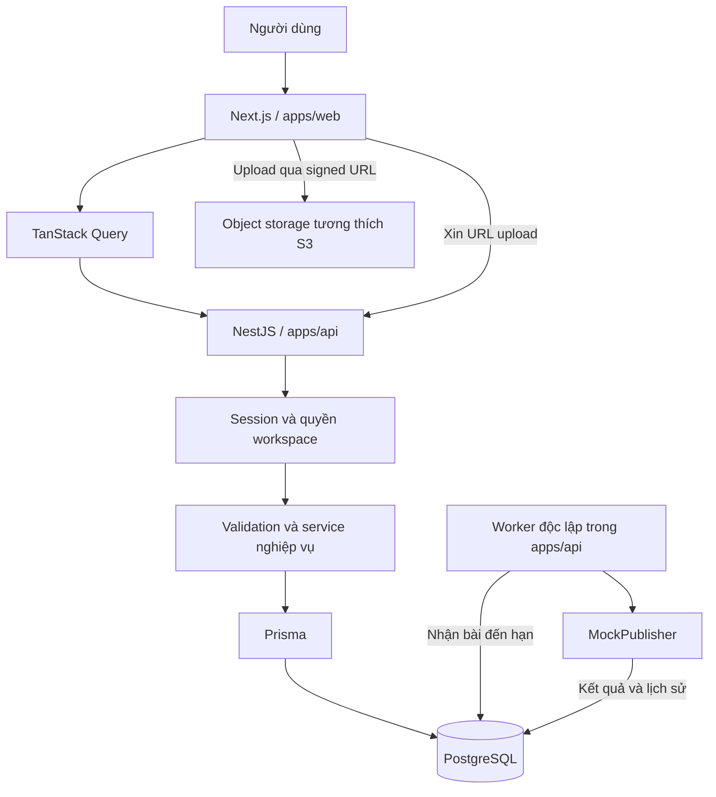

# SocialFlow — Tổng quan dự án

Ngày chốt tài liệu: 21/09/2026. Phạm vi: MVP v1.

> Tài liệu này mô tả định hướng sản phẩm và kiến trúc mục tiêu. Trạng thái triển khai được tách riêng bên dưới; các tính năng MVP chưa được coi là hoàn thành chỉ vì đã có thư viện hoặc cấu hình.

## 1. Mục tiêu

SocialFlow là ứng dụng quản lý và lên lịch nội dung dành cho người phụ trách nội dung của một nhóm marketing nhỏ. Dự án portfolio tập trung chứng minh khả năng xây dựng luồng FE hoàn chỉnh: form, upload, URL state, server state, xử lý lỗi, concurrency, responsive và kiểm thử hành vi.

Luồng chính:

**Đăng nhập → tạo bài → upload ảnh → xem trước → lên lịch → backend mô phỏng đăng → xem kết quả hoặc thử lại.**

MVP có một chủ sở hữu cho mỗi workspace. Bối cảnh sử dụng là nhóm marketing, nhưng cộng tác nhiều thành viên và phân quyền nhóm thuộc giai đoạn sau.

## 2. Phạm vi và ranh giới

| Nội dung  | MVP v1                                                                                    |
| --------- | ----------------------------------------------------------------------------------------- |
| Workspace | Tự tạo một workspace riêng cho mỗi người dùng khi đăng nhập lần đầu                       |
| Kênh      | Hai kênh mẫu Facebook và Instagram, gắn nhãn mô phỏng                                     |
| Bài viết  | Một bài thuộc một kênh; văn bản và tối đa 4 ảnh                                           |
| Quản lý   | CRUD nháp, tìm kiếm, lọc, sắp xếp, phân trang phía server                                 |
| Lịch      | Lịch tháng trên desktop, danh sách theo ngày trên mobile, đổi lịch bằng form hoặc kéo thả |
| Xuất bản  | Worker chạy độc lập, publisher mô phỏng, lưu kết quả và lịch sử                           |
| Dashboard | Thống kê trạng thái và 5 bài sắp đăng từ dữ liệu thật trong database                      |
| Giao diện | Tiếng Việt, hỗ trợ desktop/mobile và bàn phím                                             |

Làm thật: authentication, database, upload, CRUD, scheduling, xử lý job và lưu kết quả.

Mô phỏng: kết nối tài khoản mạng xã hội và việc đăng nội dung lên nền tảng. Không tạo bài đăng Facebook/Instagram thật; không hiển thị số liệu reach/engagement giả như số liệu thực.

Ngoài MVP: social API thật, TikTok, video, đăng nhiều kênh trong cùng một bài, nhiều thành viên/role, duyệt bài, AI, billing, notification center, dark mode, i18n, autosave và realtime qua WebSocket/SSE.

## 3. Kiến trúc đã chốt

Repository dùng npm workspaces với hai ứng dụng:

| Workspace                       | Trách nhiệm                                                                        |
| ------------------------------- | ---------------------------------------------------------------------------------- |
| `apps/web` — `@social-flow/web` | Next.js: routing, layout, UI, form, query/cache và tương tác người dùng            |
| `apps/api` — `@social-flow/api` | NestJS: authentication, authorization, validation, API nghiệp vụ, Prisma và worker |

Quyết định tách FE/BE thay thế phương án ban đầu dùng Next.js Route Handlers cho nghiệp vụ. Backend NestJS sở hữu authentication; không triển khai Auth.js ở FE song song.

Worker là entrypoint riêng trong workspace backend, chạy cùng code service nhưng là tiến trình riêng với HTTP server. Chưa cần thêm workspace thứ ba hoặc Redis trong MVP.

## 4. Tech stack

| Mảng         | Công nghệ                                                | Mục đích                                                             |
| ------------ | -------------------------------------------------------- | -------------------------------------------------------------------- |
| FE           | Next.js App Router, React, TypeScript                    | Giao diện và routing                                                 |
| UI           | Tailwind CSS, cấu trúc shadcn/ui, Radix, Lucide, Sonner  | Component, icon và thông báo                                         |
| Font         | Be Vietnam Pro cài local                                 | Hiển thị tiếng Việt                                                  |
| Server state | TanStack Query                                           | Fetch, cache, mutation, invalidation, polling                        |
| Bảng         | TanStack Table                                           | Cấu hình bảng, lọc/sort/phân trang phía server                       |
| Form         | React Hook Form, Zod                                     | Dữ liệu form và validation FE                                        |
| Calendar     | date-fns, dnd-kit                                        | Xử lý ngày và kéo thả                                                |
| BE           | NestJS, ConfigModule, class-validator, class-transformer | Module, cấu hình, DTO và validation server                           |
| Auth         | Passport/GitHub OAuth; session phía BE                   | Đăng nhập; thư viện JWT đã cài nhưng giao thức phiên chưa triển khai |
| Database     | PostgreSQL, Prisma                                       | Dữ liệu, migration và transaction                                    |
| Storage      | AWS SDK S3 và presigner                                  | Signed upload; nhà cung cấp storage chưa chọn                        |
| API docs     | Swagger                                                  | Tài liệu endpoint                                                    |
| Testing      | Vitest, React Testing Library, Playwright                | Unit/component và E2E                                                |
| Tooling      | npm workspaces, ESLint, Prettier, GitHub Actions         | Quản lý dependency và kiểm tra chất lượng                            |

Phiên bản cài đặt được xác định bằng `package-lock.json`; không nâng major tự động theo thông báo của CLI. Repo chốt npm 11.19.1 để xử lý dependency overrides đúng. Cách cài và chạy nằm trong [README](../README.md).

### Phân chia state

| Dữ liệu                                 | Nơi quản lý     |
| --------------------------------------- | --------------- |
| Bài viết, dashboard, lịch sử xử lý      | TanStack Query  |
| Search, filter, sort, trang, tháng lịch | URL             |
| Nội dung đang soạn và lỗi trường        | React Hook Form |
| Dialog và tab preview                   | React state     |
| Session và quyền sở hữu                 | Backend         |

Không đưa server state sang Redux/Zustand trong MVP. Optimistic update áp dụng cho đổi lịch, kèm rollback và đồng bộ lại dữ liệu khi lỗi.

## 5. Trạng thái triển khai hiện tại

Đã có bộ khung: hai workspace, dependency, cấu hình UI/query, trang kiểm tra API, NestJS health/readiness, Swagger, Prisma service, model Workspace ban đầu và migration, Docker Compose PostgreSQL, cấu hình format/lint/test/CI, env mẫu và workspace VS Code.

Chưa có: login, ownership của Workspace, CRUD bài viết, upload thật, dashboard nghiệp vụ, calendar và worker/publisher. Model Workspace hiện tại chưa đủ để mở API dữ liệu người dùng; phải thêm ownership trước.

Các test hiện có chỉ xác minh bộ khung, kết nối FE–BE, trạng thái lỗi/thử lại và chiều rộng mobile. Chúng không chứng minh các yêu cầu MVP đã hoàn thành.

## 6. Thứ tự xây dựng

| Giai đoạn     | Kết quả cần có                                                        |
| ------------- | --------------------------------------------------------------------- |
| 1. Identity   | Login/logout, session, workspace thuộc user, hai kênh mẫu             |
| 2. Nội dung   | Danh sách, URL filters, pagination, CRUD nháp, chống ghi đè phiên bản |
| 3. Media      | Upload, xác nhận file, preview và xử lý lỗi                           |
| 4. Scheduling | State machine, lên/hủy lịch, worker, attempt và retry                 |
| 5. Calendar   | Lịch tháng, mobile list, đổi lịch và rollback                         |
| 6. Hoàn thiện | Dashboard, E2E, accessibility, deploy và tài liệu demo                |

Ước lượng tham khảo từ kế hoạch ban đầu: 6–8 tuần với 10–12 giờ/tuần. Đây là ước lượng lập kế hoạch, không phải cam kết tiến độ.

## 7. Bàn giao MVP

- Demo online, repository có hướng dẫn setup, env mẫu và migration.
- FE, API và worker được triển khai với cấu hình môi trường riêng; lựa chọn hosting chưa chốt.
- Video demo 3–5 phút: tạo bài, đổi lịch, lỗi xuất bản, thử lại và mobile.
- Case study giải thích state, concurrency, kiểm thử và phần mô phỏng.
- Hoàn thành tiêu chí trong [Yêu cầu MVP](./MVP_REQUIREMENTS.md).
